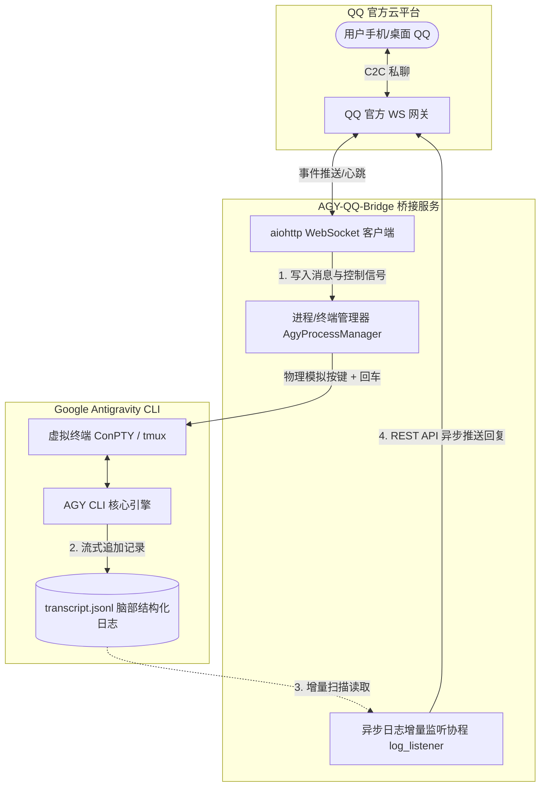

# AGENTS.md — AGY-QQ-Bridge 开发者与 AI 代理指南

欢迎来到 **AGY-QQ-Bridge** 代码库。本文件专为参与维护、重构或在此系统上扩展功能的 AI 代理与开发者编写，概述系统核心架构、运行机制、双平台实现差异及操作规范。

---

## 1. 项目定位与核心设计哲学

**AGY-QQ-Bridge** 是将本地运行的 **Google Antigravity CLI (`agy`)** 实例通过官方 QQ 开放平台 WebSocket 网关直连至 QQ 私聊（C2C）通道的轻量级桥接系统。

### 核心设计哲学：完全解耦与去状态机
传统的问答式机器人往往使用“等待响应”的同步阻塞式状态机，极易在长耗时任务、工具调用审批或网络抖动时导致死锁与超时。本项目采用以下架构：



1. **输入与输出完全解耦**：
   - 输入端仅负责模拟物理按键向 CLI 发送字符，立即返回。
   - 输出端通过后台常驻协程监听 AGY 的脑部日志文件（`transcript.jsonl`），以增量偏移（file seek）读取模型最终回复并推送回 QQ。
2. **支持“一次输入，多次回复”**：
   - AGY 在执行复杂长任务时分步输出的状态和回复，均能被增量监听协程逐条捕获回传。
3. **原生多模态透传**：
   - 收到 QQ 图片、文件、语音等附件时不执行本地下载缓存，直接提取临时直链以 `[附件(name): url]` 形式拼接入 Prompt，交由 AGY 原生多模态解析。
4. **本地零 Token 快速诊断拦截**：
   - 常见的系统状态巡检（如 `/status`、`git status`）与控制指令（`/help`、`/stop`）均在桥接层本地瞬间完成，耗时毫秒级且完全绕过大模型推理，节省 100% Token。
5. **QQ 开放平台自定义菜单与面板自动化集成**：
   - 原生对接 QQ 开放平台 OpenAPI，启动时自动注册/同步私聊底部自定义菜单与全局指令面板（Panel），支持富交互快捷点按。

---

## 2. 代码库目录结构

```text
AGY-QQ-Bridge/
├── AGENTS.md                  # 本文件：AI 代理与开发者指南
├── README.md                  # 项目主文档（面向 Linux / 通用用户）
├── pyproject.toml             # Python 项目元数据
├── requirements.txt           # 核心依赖清单
├── .env.example               # 环境变量配置模板
├── agy-qq-bridge.py           # Linux 单文件启动入口
├── agy-conversation-monitor.py# 本地与 QQ 双通道日志监控工具
├── 启动机器人.bat              # Windows 一键启动脚本
├── manage_menu_panel.py       # QQ 开放平台自定义菜单与指令面板管理工具
├── src/
│   └── agy_qq_bridge/         # Linux / 通用模块化实现
│       ├── __init__.py
│       ├── __main__.py
│       └── bridge.py          # 基于 tmux 的 Linux 核心桥接实现
├── windows/
│   ├── README.md              # Windows 原生部署说明
│   └── agy_qq_bridge_win.py   # 基于 Windows ConPTY 的原生桥接实现
├── docs/                      # 架构演化案例与研究报告
│   ├── CASE_STUDY.md          # 终端交互方案的演进历史
│   ├── EXECUTIVE_BRIEF.md     # 系统边界与架构摘要
│   └── GOOGLE_FEEDBACK.md     # 针对 CLI 观察能力的反馈建议
└── evidence/                  # 历史版本调试与设计证据链
```

---

## 3. 双平台运行时架构差异

由于 Linux 与 Windows 底层终端子系统的差异，本项目维护了双套终端管理实现：

| 特性 / 组件 | Linux 运行时 ([bridge.py](file:///E:/Git/AGY-QQ-Bridge/src/agy_qq_bridge/bridge.py)) | Windows 运行时 ([agy_qq_bridge_win.py](file:///E:/Git/AGY-QQ-Bridge/windows/agy_qq_bridge_win.py)) |
| :--- | :--- | :--- |
| **终端载体** | `tmux` Session（默认名称 `0`） | Windows 伪控制台 ConPTY (`pywinpty.PtyProcess`) |
| **消息发送方式** | `tmux send-keys -t 0 message Enter` | `PtyProcess.write(message + "\r\n")` |
| **启动挂起处理** | 原生 PTY，通常无需终端探测握手 | 自动应答终端能力探测 (`\x1b[c` $\rightarrow$ `\x1b[?1;2c`) |
| **异步网络解析** | 默认 asyncio resolver | 修复 Windows Proactor 事件循环：使用 `ThreadedResolver` |
| **会话隔离机制** | 单用户独立环境 | `AGY_WORKSPACE` 工作区隔离 + Prompt 指纹内容比对 |
| **服务保活方式** | `pm2` / `systemd` | Windows 任务计划程序 / `nssm` / 批处理 |
| **打断安全策略 (`/stop`)** | 结合 `is_busy` 状态：空闲发 `Escape`；忙碌发 `C-c` + `Escape` | 结合 `is_busy` 状态：空闲发 `\x1b` 防误退；忙碌发单次 `\x03` + `\x1b` 且带进程自愈守护 |
| **菜单/面板自同步** | 启动时异步协程调用 `_sync_menu_and_panels()` | 启动时异步协程调用 `_sync_menu_and_panels()` |

---

## 4. 会话定位与动态绑定机制（Windows 特别关注）

在 Windows 原生开发环境下，用户常在 Antigravity IDE 中同时工作。为避免桥接器误抓 IDE 的聊天日志，[windows/agy_qq_bridge_win.py](file:///E:/Git/AGY-QQ-Bridge/windows/agy_qq_bridge_win.py) 实现了**三重会话判定机制**：

1. **工作区隔离 (`AGY_WORKSPACE`)**：
   - AGY CLI 内部根据运行工作区在 `~/.gemini/antigravity-cli/cache/last_conversations.json` 中记录当前会话。
   - 桥接器启动时默认使用 `USERPROFILE`，并在每次检测时优先检查该工作区对应的专属会话 ID，避免串入项目目录（如 `E:\Git\...`）的会话。
2. **首条消息指纹校验 (`transcript_has_prompt`)**：
   - 在用户发送 `/new` 重置会话后，新会话文件夹不会立即生成，直到发送第一条消息。
   - 桥接器会记录发出的 Prompt 文本（如“早上”），在新日志文件诞生时校验其前数行是否包含该 Prompt，确保 100% 绑定到本机器人所拉起的会话。
3. **冷启动与热切换区分 (`is_cold_start`)**：
   - **冷启动**：服务刚刚开启时，跳过现有文件的所有历史记录（`_last_log_size = stat().st_size`），防止历史回复刷屏。
   - **热切换 / 新会话**：在运行时通过 `/new` 或换会话拉起的新日志，强制从第 0 字节开始监听（`_last_log_size = 0`），确保第一条回复绝不漏发。

---

## 5. 配置参数表 (`.env`)

所有运行时配置均支持通过项目根目录或脚本同级目录下的 `.env` 文件覆盖：

```env
# 核心凭证（必须）
APP_ID=你的QQ机器人AppID
CLIENT_SECRET=你的QQ机器人Secret
MASTER_OPENID=你的管理员OpenID（留空时会自动绑定首次私聊你的用户）

# 启动与路径配置
AGY_START_CMD=C:\Users\Administrator\AppData\Local\agy\bin\agy.exe --dangerously-skip-permissions
BRAIN_DIR=C:\Users\Administrator\.gemini\antigravity-cli\brain
LOG_DIR=C:\Users\Administrator\.agy-qq-bridge

# 进阶会话控制（可选）
AGY_WORKSPACE=C:\Users\Administrator\.agy-qq-bridge\workspace   # 机器人独立工作区
TARGET_CONV_ID=                                                 # 固定锁死指定会话UUID
EXCLUDE_CONV_IDS=                                               # 排除的会话UUID（逗号分隔）
```

---

## 6. 指令处理协议与本地拦截机制

当用户在 QQ 私聊（C2C）或群聊中发送内容时，系统优先在桥接层进行本地意图拦截与权限校验，未匹配本地指令时才作为 Prompt 写入终端：

### 6.1 核心交互指令与安全防护

*   **`/new` / `/reset` / `/清空` / `/新对话`**：
    1. 终止当前正在运行的 AGY 终端进程/tmux 会话。
    2. 设置 `fresh_time = time.time()`，并将内部绑定的日志置空。
    3. 重置终端忙碌标记 `is_busy = False`。
    4. 拉起不带 `-c`（不续接）的全新常驻 AGY CLI 进程。
    5. 立即向 QQ 回复会话已重置，等待首条新指令唤起新会话日志。
    *(群聊场景下仅限 MASTER_OPENID 管理员触发)*

*   **`/stop` / `/停止` / `/kill` (智能终端安全防护机制)**：
    1. **状态感知 (`is_busy`)**：检查当前终端是否处于命令执行/流式输出中。
    2. **空闲状态防误退**：若终端处于空闲就绪状态（`is_busy == False`），**绝对禁止**发送连续 Ctrl+C（避免导致底层 CLI 进程被操作系统意外杀死），仅发送无害的 `\x1b`（Escape 键）清理残留交互，并友好提示“当前处于空闲就绪状态，无需中断”。
    3. **忙碌执行打断**：若确实正在生成或执行长耗时工具（`is_busy == True`），向终端物理写入单次 `\x03`（Ctrl+C）并延迟追加 `\x1b`，恢复命令行提示符。
    4. **进程保活自愈**：Windows ConPTY 环境下在打断后自动检查进程存活状态，若异常退出则立即拉起新进程守护。
    *(群聊场景下仅限 MASTER_OPENID 管理员触发)*

*   **`/git status` / `git status` / `/git diff` / `/git` (本地秒级诊断拦截)**：
    1. 桥接器通过异步子进程在当前机器人绑定的 `AGY_WORKSPACE` 目录下直接执行 `git status -s` 和 `git branch --show-current`。
    2. 耗时通常小于 20ms，格式化为 Git 状态代码块直接返回给 QQ 用户。
    3. **零 Token 消耗**：完全不提交给大模型，避免长耗时模型分析与上下文浪费，杜绝大模型产生 Git 状态幻觉。

*   **`/help` / `/帮助`**：
    1. 立即拦截并返回机器人的控制中心指令帮助说明，不透传给大模型消耗 Token。

*   **`/status` / `/状态`**：
    1. 立即返回当前机器人的工作区路径、活跃会话 UUID（若已绑定）、终端存活状态、当前进程活跃度与管理员标识。

*   **常规对话**：
    1. 标记 `is_busy = True`。
    2. 物理写入 `\x1b`（Escape 键），退出可能因分页器（PAGER）或菜单卡死的状态。
    3. 物理写入消息内容并追加回车 `\r\n`。
    4. 增量日志监听到完整的最终回复时，自动复位 `is_busy = False`。

---

### 6.2 QQ 开放平台自定义菜单与指令面板生态集成 ([manage_menu_panel.py](file:///E:/Git/AGY-QQ-Bridge/manage_menu_panel.py))

本项目集成了 QQ 开放平台官方的交互式入口能力，桥接服务启动时会通过后台协程 `_sync_menu_and_panels()` 自动部署与维护：

1. **C2C 底部自定义菜单 (`/v2/menu`)**：
   - 仅对私聊用户生效，常驻于手机 QQ 键盘底部。
   - 包含快捷状态查询、工作区变动诊断、新对话重置、项目主页跳转与指令帮助。
   - **平台规范约束**：二级菜单最多 5 个，二级菜单标题长度严格限制（≤ 14 字符 / 约 7 个中文字符），超长会导致 API 报错。
2. **全局指令面板 (`/v2/panels`)**：
   - 支持 C2C 私聊、群聊和频道聊天，在输入框快捷唤起面板选择指令。
   - **平台配额约束与幂等维护**：QQ 开放平台规定每个机器人最多创建 20 个面板。系统在同步时通过面板备注（remark）进行精准幂等查找与更新（`ensure_panel`），杜绝因重复启动导致面板堆积触顶（400 错误）。

---

## 7. 给后续 AI 代理的开发与维护准则

在修改或扩展本代码库时，请严格遵守以下规则：

1. **严禁硬编码任何具体的会话 UUID**：
   - 绝不能将个人调试产生的临时 UUID 写进源码中。所有的对话匹配必须基于工作区、Prompt 指纹或环境变量过滤。
2. **严禁将敏感凭证纳入 Git 跟踪**：
   - 保持 `.gitignore` 的有效性，严禁将包含真实 `APP_ID`、`CLIENT_SECRET` 的 `.env` 提交到仓库。
3. **维护终端握手机制的健壮性**：
   - Windows 平台使用 ConPTY 时，AGY CLI 会发送 `\x1b[c` 探测设备能力，必须在后台数据排空协程中自动响应 `\x1b[?1;2c`，否则会导致进程启动阻塞挂起。
4. **日志偏移量计算须区分场景**：
   - 修改 `bind_log` 逻辑时，牢记区分“服务初次启动（忽略既往历史）”与“会话动态创建（必须从头读取第一条新回复）”。
5. **严禁在终端空闲时滥发 Ctrl+C (`\x03`)**：
   - Windows ConPTY 与部分 CLI 工具在空闲提示符下收到多次连续 `\x03` 会直接导致主进程退出。必须检查 `is_busy` 状态，仅在任务忙碌时打断；空闲状态仅发 `\x1b`。
6. **轻量诊断与系统控制必须优先走本地拦截**：
   - 对于查询状态、工作区 Git 变动、重置会话等操作，必须由桥接层本地异步处理后直接回复用户，严禁透传给大模型消耗昂贵的上下文 Token 与时间。
7. **QQ 菜单与指令面板的配额与字段规范**：
   - 指令面板（Panels）全局上限 20 个，修改面板逻辑必须使用备注（remark）做幂等比对，禁止无脑调用新增接口。
   - 菜单二级菜单项名称不可超过 14 个字符（约 7 个中文字符）。
