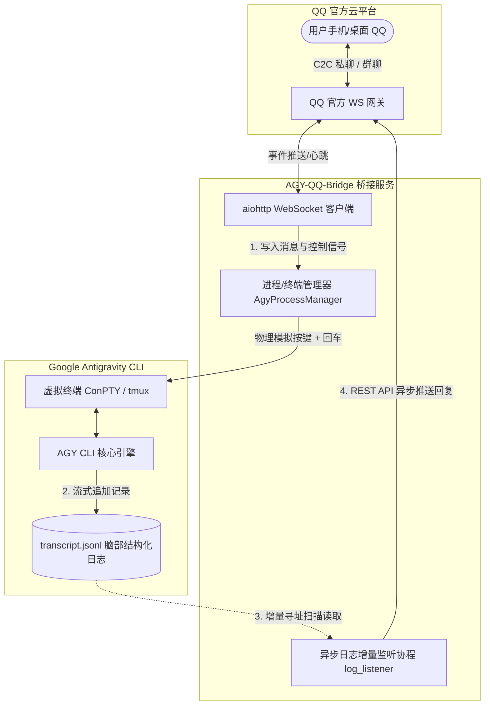

# AGY-QQ-Bridge: 极简 C2C 异步日志增量 QQ 桥接器

[](https://github.com/lzx722/AGY-QQ-Bridge)
[](https://github.com/zz327455573/AGY-QQ-Bridge)
[](https://github.com/zz327455573/agent-keep)

AGY-QQ-Bridge 是一个用于将本地常驻运行的 Google Antigravity (AGY) 实例直连到 QQ 个人私聊通道的轻量级桥接系统。

通过采用“去状态机、完全解耦收发、纯异步日志增量监听”的现代化设计，本项目彻底解决了一问一答式同步卡死、时序对不上、以及长耗时任务多次分段回复丢失的痛点。

---

## 🌟 核心架构与优势



*   **输入输出完全解耦**：QQ 消息只管模拟按键送入终端，后台协程只管增量监听日志并广播回传。无忙碌锁、无同步超时死锁。
*   **支持“一次输入，多次回复”**：完美契合 AI 助手在执行长耗时任务时分步骤、断断续续地汇报进度的行为特征，保证所有发出的文字 100% 被捕获回传。
*   **跨平台原生虚拟终端**：Linux 原生适配 `tmux`；Windows 原生适配微软伪控制台 `ConPTY`，自动完成 `\x1b[c` 握手探测应答并具备进程保活自愈能力。
*   **自适应重置与热绑定**：在执行 `/new` 切换或重置会话时，监听器会在 0.5 秒内自动绑定新生成的日志文件，并自动定位水位线，杜绝任何历史消息的重复刷屏与多实例逻辑混乱。

---

## 🛠️ 安装与运行

### 1. 环境准备

需要 Python 3.10+ 环境。Linux 环境推荐安装 `tmux`；Windows 原生环境无需额外系统组件，已原生支持 ConPTY。

```bash
# 从源码克隆并安装
git clone https://github.com/lzx722/AGY-QQ-Bridge.git
cd AGY-QQ-Bridge
pip install -e .

# 查看已安装的可执行命令
which agy-qq-bridge
```

### 2. 配置环境变量

```bash
# 方式 A：通过交互式命令引导生成配置
agy-qq-bridge --init

# 方式 B：直接复制配置文件模板
cp .env.example .env
```

核心 `.env` 配置参数说明：

*   `APP_ID` / `CLIENT_SECRET`：QQ 开放平台机器人凭证（必须）
*   `MASTER_OPENID`：机器人的管理员 QQ OpenID（留空时首次私聊会自动绑定）
*   `AGY_START_CMD`：AGY 启动命令
    *   Linux 示例：`cd ~ && agy --dangerously-skip-permissions`
    *   Windows 示例：`C:\Users\Administrator\AppData\Local\agy\bin\agy.exe --dangerously-skip-permissions`
*   `AGY_WORKSPACE`：机器人专属独立工作区目录（推荐配置，彻底杜绝与本地 IDE 开发会话串台）
*   `BRAIN_DIR`：AGY 脑部结构化日志存放路径（默认为 `~/.gemini/antigravity-cli/brain`）
*   `LOG_DIR`：桥接服务运行日志存储目录（默认 `~/.agy-qq-bridge`）
*   `TMUX_SESSION`：Linux 环境下 AGY 运行的 tmux 会话名（默认 `0`）

### 3. 使用 PM2 进行守护与热启动

推荐使用 Node.js 的进程管理器 `pm2` 来保证桥接服务的持续运行：
```bash
# 启动桥接服务
pm2 start agy-qq-bridge.py --name agy-qq-bridge

# 查看运行状态与实时日志
pm2 status
pm2 logs agy-qq-bridge
```

---

## 💬 交互指令介绍

在 QQ 个人私聊或群聊中，您可以向您的机器人发送以下控制指令：

| 指令 | 作用 | 内部实现逻辑 |
| :--- | :--- | :--- |
| **`/help`** | 使用帮助 | 返回机器人的快捷指令手册、使用说明及操作指引 |
| **`/status`** | 运行状态 | 快速查看当前工作区路径、当前活跃会话主题、终端及桥接器存活状态 |
| **`/history`** | 历史会话 | 零 Token 扫描历史会话列表，展示项目名、活跃时间与会话主题并生成连续序号（支持范围如 `/history 31-40`、页码如 `/history p4`、数量如 `/history 10`） |
| **`/resume`** | 恢复会话 | 输入编号（如 `/resume 1`）切换会话，限 `/history` 后 90 秒内使用且最多跳转 3 次，自动热同步工作区目录 |
| **`/rename`** | 重命名会话 | 输入 `/rename <新主题>` 实时修改当前已绑定会话主题（全面防误当 resume/history 参数校验），在持久层中同步更新 |
| **`/new`** | 重置会话 | 强杀旧会话 ➔ 自动拉起全新无上下文 AGY 进程 ➔ 0.5s 内自动热绑定全新日志 |
| **`/stop`** | 强行终止 | 处于忙碌时发送 `Ctrl+C` 中断长耗时任务；处于空闲时智能发送 `Escape` 防误退 |
| **`git status`** | 工作区诊断 | 毫秒级本地执行并返回当前工作区 Git 变动状态，零 Token 消耗 |
| **任意文字** | 交互输入 | 发送 Escape 清理终端 TUI 状态 ➔ 物理模拟键入 ➔ 回车发送给 AGY |
| **图片/文件** | 多模态解析 | 原生提取 QQ 临时直链，以 `[附件(name): url]` 形式交由 AGY 多模态解析 |

---

## 📱 自定义菜单与指令面板配置

机器人支持两种便捷交互界面（基于 QQ 开放平台官方 OpenAPI）：
1. **自定义菜单 (Custom Menu)**：位于手机/桌面 QQ **单聊窗口底部常驻菜单栏**，支持点击直接填入指令（如 `/new`、`/stop`）或展开二级折叠菜单。
2. **指令面板 (Command Panel)**：位于**输入框快捷指令面板**（输入 `/` 或点击面板呼出），支持单聊（C2C）与群聊（Group），展示指令名称与功能介绍。

### 自动化注册与管理 (`menu_panel`)

* **全自动零干预注册**：桥接服务（Windows `agy_qq_bridge_win.py` 与 Linux `bridge.py`）在启动时由后台原生异步协程（`menu_panel.py`）自动向 QQ 开放平台注册/同步单聊自定义菜单与 C2C/群聊指令面板，**完全无需任何手动配置**。
* **手动排障/查询（可选）**：
  若需手动检查或重置开放平台菜单，可执行排障命令（或在安装包后使用 `python -m agy_qq_bridge.menu_panel`）：
  ```bash
  # 1. 查询当前生效的全局自定义菜单
  python src/agy_qq_bridge/menu_panel.py --menu-get

  # 2. 一键强制同步所有默认菜单与指令面板
  python src/agy_qq_bridge/menu_panel.py --sync-all

  # 3. 清空全局自定义菜单
  python src/agy_qq_bridge/menu_panel.py --menu-clear

  # 4. 查看指令面板列表 (c2c / group)
  python src/agy_qq_bridge/menu_panel.py --panel-list c2c
  ```

---

## 📝 更新日志

### v2.2.0 (2026-09-12)
*   **核心架构分层解耦重构**：将原先单体脚本重构为模块化架构（`config` 配置中心、`terminal` 终端抽象层、`session_manager` 会话生命周期、`qq_client` 通信客户端、`log_listener` 日志监听、`bridge` 调度中心），大幅消除冗余代码。
*   **跨平台虚拟终端抽象**：Linux (`TmuxTerminalManager`) 与 Windows (`WinptyTerminalManager`) 统一接口，自动应答 `\x1b[c` 握手并具备进程自愈能力。
*   **会话历史与切换增强 (`/history`, `/resume`)**：
    *   原生 100% 对齐 AGY 原生规则，过滤空会话；
    *   灵活支持范围模式（如 `/history 31-40`）、分页模式（如 `/history p4`）与单次 15 条安全上限；
    *   限制 `/resume` 在 `/history` 查询后 90 秒内使用且单轮最多跳转 3 次，防止误操作；
    *   移动端视觉排版优化（第一行会话名称、第二行工作区与时间，隐藏内部 UUID）。
*   **会话重命名三重持久化 (`/rename`)**：
    *   实现 `annotations/<cid>.pbtxt` + `conversation_metadata.json` + SQLite `conversation_summaries.db` 同步更新，杜绝重启被 AGY 覆盖；
    *   全指令参数防御机制，严防误将 resume/history 指令或参数当做主题写入。
*   **零 Token 诊断与智能打断**：`git status` 本地秒级直接执行；`/stop` 空闲状态发 `Escape` 防误退、忙碌状态单次 `Ctrl+C` 安全中断。

### v2.1.0 (2026-07-01)
*   支持 `--init` 交互式配置生成并支持自定义 `AGY_START_CMD`；
*   完善 `.env.example` 与文档说明。

### v2.0.0 (2026-06-29)
*   **多模态支持**：实现了附件功能的零阻拦直传。机器人接收到图片、语音（SILK格式）、视频以及任意文件后，不再进行本地缓存，而是将 QQ 临时下载 URL 自动原样透传给大模型进行原生多模态识别与解析；
*   **代码优化**：升级 API 请求 User-Agent 头至 `AGY-QQ-Bridge/2.0`。

---

## 🙏 致谢 (Credits & Acknowledgments)

本项目基于 [zz327455573/AGY-QQ-Bridge](https://github.com/zz327455573/AGY-QQ-Bridge) 与 [Agent Keep](https://github.com/zz327455573/agent-keep) 生态项目进行深度重构与架构升级。

由衷感谢原作者 **[zz327455573](https://github.com/zz327455573)** 及开源社区贡献者的最初探索与卓越灵感，奠定了通过增量日志监听与虚拟终端解耦操控 Antigravity CLI 的开创性思路！